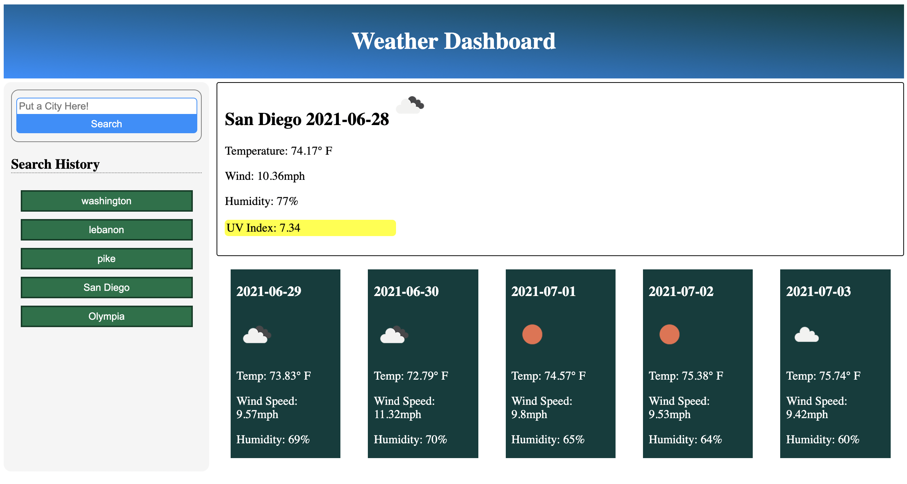

# weather-dashboard
Allows user to search for weather in multiple cities and receive multiple forecasts

https://maxd66.github.io/weather-dashboard/

## Description

This weather dashboard is a convenient way to search a specific city and find the weather for that place. It will log the current weather and five day forecast. The website uses the open weather api to search for the weather. The background of the website also changes dynamically based on the user's time. There are currently four time periods respected. Night, Sunrise, Day, and Sunset.

## Installation and Usage

There is no installation required.

## Credits

I worked on the html, css, and javascript on my own.

## License

The website was insired by a mockup provided by UCSD Coding Bootcamp Extension.

